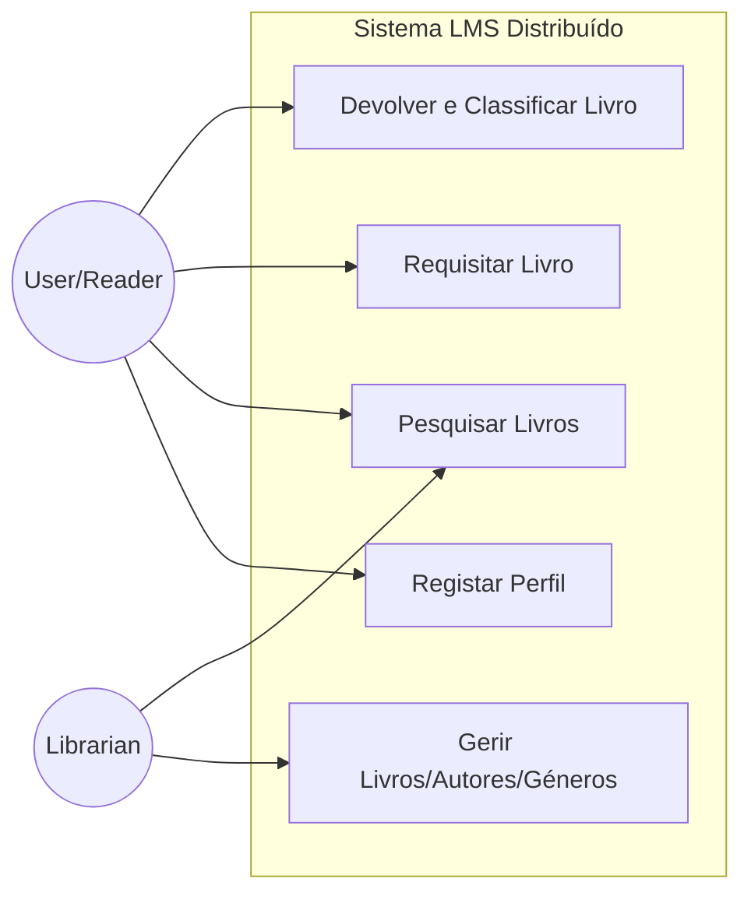
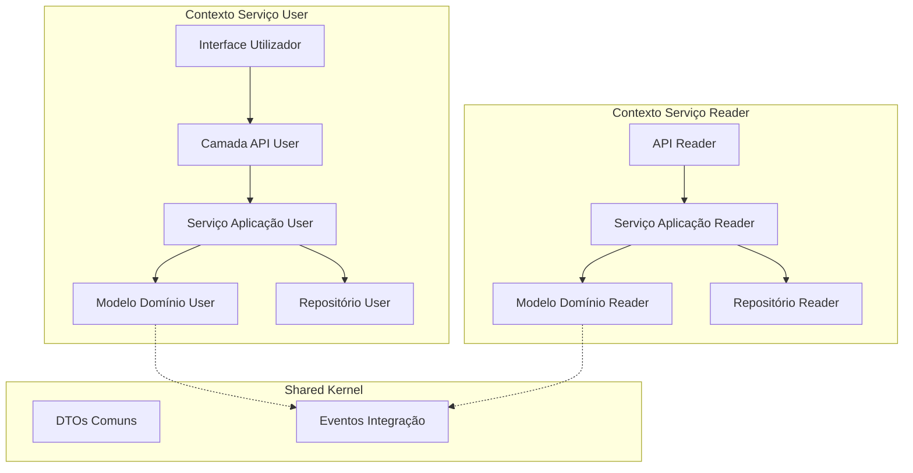
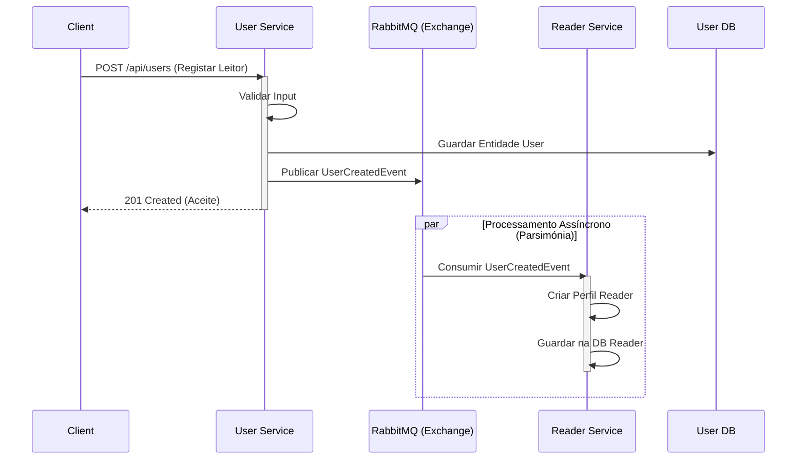
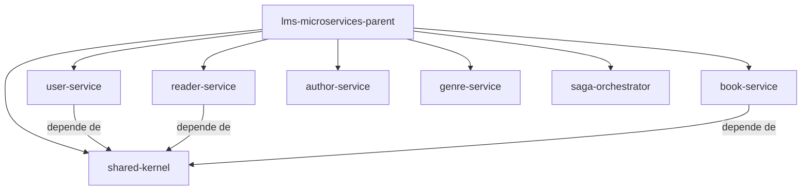
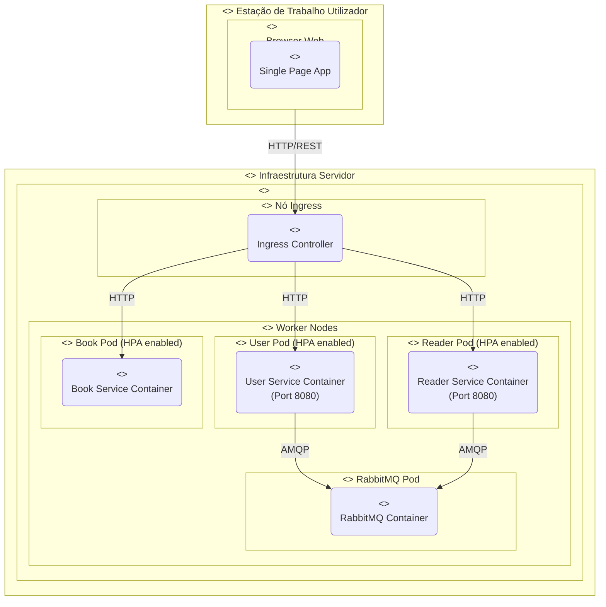

# Documentação de ARQSOFT - Projeto 2

## Arquitetura de Software (Modelo 4+1 Vistas)

Este documento fornece uma visão arquitetural abrangente do sistema ARQSOFT/ODSOFT utilizando o Modelo de Vistas 4+1, desenhado para abordar os problemas de centralização e suportar a reengenharia para uma arquitetura distribuída.

### 1. Vista de Cenários (+1)

Esta vista descreve a funcionalidade do sistema da perspetiva do utilizador, capturando as interações principais.

#### Histórias de Utilizador Principais
*   **Student A (Bibliotecário)**: "Como bibliotecário, quero criar um Livro, Autor e Género no mesmo processo."
*   **Student B (Bibliotecário)**: "Como bibliotecário, quero criar um Leitor e o respetivo Utilizador no mesmo pedido."
*   **Student C (Leitor)**: "Como leitor, ao devolver um livro, quero deixar um comentário e classificação (0-10)."

#### Diagrama de Casos de Uso

### 2. Vista Lógica

Esta vista foca-se nos requisitos funcionais e na estrutura interna do sistema, empregando princípios de Domain-Driven Design (DDD) com uma Arquitetura em Camadas distribuída.

#### Componentes do Sistema (Diagrama de Componentes)

#### Estrutura da Arquitetura em Camadas
Cada Microserviço segue este estratificação interna:
1.  **Interface Layer (API)**: Controladores REST (Conectividade API-Led).
2.  **Application Layer**: Orquestração de serviços, comandos/queries.
3.  **Domain Layer**: Entidades (`User`, `Book`, `Author`), Value Objects, Lógica de Domínio.
4.  **Infrastructure Layer**: Repositórios (JPA), Publicadores de Mensagens (RabbitMQ), APIs Externas.

### 3. Vista de Processos

Esta vista explica o comportamento dinâmico e a concorrência, focando especificamente na Arquitetura Orientada a Eventos para suportar desempenho e escalabilidade.

#### Fluxo de Criação de Leitor (Requisito Student B)
*Implementação do padrão Saga para consistência eventual entre User e Reader.*

### 4. Vista de Desenvolvimento (Implementação)

Esta vista ilustra a organização do software no ambiente de desenvolvimento. Apesar da distribuição, utilizamos uma estrutura de Multi-Module Maven para partilha de contratos (Shared Kernel).

### 5. Vista Física (Implantação)

Esta vista ilustra como o sistema mapeia os containers para a infraestrutura Kubernetes, suportando a escalabilidade horizontal.

---

## Cumprimento dos Requisitos ARQSOFT (Projeto 2)

Esta secção detalha como a solução responde aos requisitos de ARQSOFT.

### Requisitos Não-Funcionais (NFRs)
*   **Disponibilidade**: A migração para microserviços e réplicas K8s assegura que a falha de um módulo não derruba o sistema.
*   **Performance (+25% em alta carga)**:
    *   Bases de dados dedicadas por serviço eliminam contenção.
    *   Processamento assíncrono (RabbitMQ) para escritas pesadas liberta recursos rapidamente.
*   **Parsimónia de Hardware (Elasticidade)**:
    *   **Horizontal Pod Autoscaler (HPA)**: O sistema escala instâncias automaticamente apenas quando a carga excede o limiar Y, libertando recursos ("scale-down") em períodos de baixa atividade.
*   **Estabilidade da API**:
    *   **API-Led Connectivity**: Interfaces bem definidas.
    *   **Pact Tests**: Garantia de compatibilidade de contratos sem afetar clientes existentes.

### Requisitos Funcionais
*   **Student B (Bibliotecário - User & Reader)**:
    *   **Solução**: Implementado via Coreografia de Eventos (Saga). O pedido HTTP termina rápido após criar o User, e o Reader é criado assincronamente, garantindo consistência eventual e alta performance.
